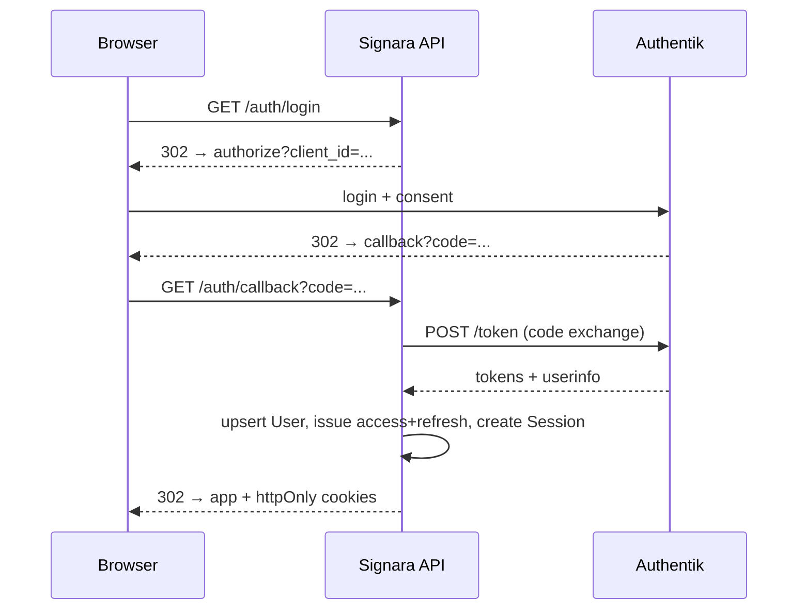

# Signara — System Architecture

## 1. Overview

Signara is a self-hosted, multi-tenant digital document signing platform built as
a monorepo of TypeScript applications:

```
                        ┌──────────────────────────────────────────────┐
   browser / signer     │                  Reverse proxy               │
   ───────────────────► │  NGINX Proxy Manager (TLS, WAF)             │
                        └──────┬───────────────┬───────────────┬───────┘
                               │               │               │
                     ┌─────────▼───┐   ┌───────▼────────┐  ┌───▼─────────┐
                     │  apps/web   │   │   apps/api     │  │  Authentik  │
                     │  Next.js    │◄──►│  NestJS +     │◄──►│  IdP (OIDC) │
                     │  (BFF-ish)  │   │  BullMQ        │  │             │
                     └─────────────┘   └───┬─────┬───────┘  └─────────────┘
                                           │     │  jobs
                                   ┌───────▼─┐ ┌─▼────────┐
                                   │  Redis  │ │ BullMQ   │
                                   └─────────┘ └─┬────────┘
                        ┌──────────┬─────────────┼──────────┐
                        ▼          ▼             ▼          ▼
                  ┌─────────┐ ┌────────┐  ┌──────────┐ ┌──────────────┐
                  │Postgres │ │ MinIO  │  │Meilisearch│ │ Observability│
                  │ (Prisma)│ │ (S3)   │  │ (search)  │ │ Prom/Grafana │
                  └─────────┘ └────────┘  └──────────┘ │ Loki/Am      │
                                                       └──────────────┘
```

### Components

| Component           | Technology              | Responsibility                                            |
| ------------------- | ----------------------- | --------------------------------------------------------- |
| `apps/web`          | Next.js 14 (App Router) | UI, signing room, public pages                            |     | `apps/api` | NestJS 10 | REST API (`/api/v1`), RBAC, tenant isolation, workflow engine |
| `packages/database` | Prisma + PostgreSQL     | Schema, migrations, seed                                  |
| `packages/shared`   | TypeScript              | Shared constants and contracts                            |
| Redis / BullMQ      | ioredis / bullmq        | Queues: notifications, signing reminders, audit exports   |
| MinIO               | S3-compatible           | Immutable object storage for documents & signature images |
| Meilisearch         | Meilisearch             | Full-text search over documents (tenant-filtered)         |
| Authentik           | goauthentik             | Identity provider: OIDC/OAuth2, MFA, SAML, SCIM, groups   |

## 2. Multi-tenancy

Tenancy hierarchy:

```
Platform (PLATFORM_ADMIN)
 └── Organization (owner: OWNER)
      ├── Workspaces (visibility: PRIVATE | TEAM | ORGANIZATION)
      │    └── Teams
      ├── Members (roles: OWNER, ADMIN, MANAGER, AUDITOR, MEMBER)
      ├── Documents / Templates / SigningRequests (organizationId scoped)
      └── BillingAccount (1:1)
```

Tenant isolation is enforced at **three layers**:

1. **Schema** — every tenant row carries `organizationId`; FKs cascade within the
   tenant. Audit rows are org-scoped.
2. **API** — the `TenantGuard` rejects requests without a resolved tenant;
   all service queries filter by `organizationId`.
3. **Storage/search** — object keys are prefixed `{orgId}/documents/...` and
   Meilisearch queries are filtered by `organizationId` server-side.

See [AdministrationGuide.md — Tenant isolation](AdministrationGuide.md#tenant-isolation).

## 3. Authentication & authorization

1. User hits `/api/v1/auth/login` → API redirects to Authentik (OIDC
   authorization-code + signed, browser-bound state).
2. Authentik redirects back with a code; the API exchanges it at the token
   endpoint, fetches userinfo, upserts the local `User`, and issues:
   - a short-lived **access JWT** (15 min, HS256, `sub` = local user id)
   - a **refresh token** (30 d) whose SHA-256 (with a browser fingerprint) is
     stored in the `Session` table; stored as httpOnly cookies.
3. Every request: `JwtAuthGuard` verifies the token (JWKS for IdP tokens; local
   secret for Signara tokens) and resolves the active tenant + permission set.
4. `PermissionsGuard` enforces fine-grained RBAC from the system `Role →
Permission` graph; platform admins (IdP group `signara-admins`) bypass checks.
5. Machine clients authenticate with `X-API-Key` (hashed at rest, revocable).



## 4. Signing workflow (domain core)

```
createRequest(documentId, signers[], mode)
  │  validates document + signers (1..50, unique emails)
  ├─ SEQUENTIAL: signer[0]=INVITED, rest=PENDING (next unlocks on sign)
  └─ PARALLEL:   all signers INVITED
  │  → SignatureEvent(CREATED, INVITED)
  │  → enqueue 'signing' jobs (invite emails)
signer opens /sign/{token}
  → publicSession(token)   [token = credential, 404 when void/cancelled/expired]
  → records VIEWED event (IP, UA)
sign(token, {...})          [role != CC, sequential turn respected]
  → SHA-256 over document bytes||signer||request (content binding)
  → Signature row (type, certificateSerial?, hash, IP, UA)
  → Event(SIGNED); advanceWorkflow()
     - all signed → request COMPLETED, document COMPLETED
     - sequential → next signer INVITED + email
decline(token) → Event(DECLINED); sequential requests pause (IN_PROGRESS)
remind()       → 1x/24h per signer; enqueues reminder job
evidenceReport() → full envelope: events, hashes, IPs, timestamps, statement
```

Workflow rules (`WorkflowRule` — APPROVE/ROUTE/REQUIRE/NOTIFY) layer conditional
routing on top of the linear flow; the rule engine evaluates `condition` JSON
against signer/signature state.

### 4.1 Certificate-backed signing (advanced)

Certificate-backed signatures are layered onto the same `sign(token, …)` flow:

```
sign(token, { type: CERTIFICATE, certificateId, certificateSerial, signatureValue? })
  → CertificatesService.signWithCertificate()
     1. load cert (tenant-scoped, ACTIVE, unexpired)
     2. bind identity: cert.email == signer email OR cert.userId == signer
     3. signature: server-held key → sign digest (RSA/ECDSA); provider-held key
        → caller supplies signatureValue, verified against the cert public key
     4. snapshot identity assurance → stored on the Signature row (JSONB)
  → Signature(type=CERTIFICATE, certificateId, certificateSerial, signatureValue,
              signatureFormat, cryptoAlgorithm, identityAssurance)
```

Providers live under `apps/api/src/modules/certificates/providers/` behind a
common interface with three implementations:

| Provider         | Kind           | Flow                                                                                                                      |
| ---------------- | -------------- | ------------------------------------------------------------------------------------------------------------------------- |
| **ACME**         | `ACME`         | RFC 8555 issuance via `acme-client` (Let's Encrypt, ZeroSSL, enterprise ACME CAs); DNS-01 preferred for email-bound certs |
| **Cerulean**     | `CERULEAN`     | config-driven REST signature service (signatureValue supplied at signing time; the key never leaves the provider)         |
| **Internal PKI** | `INTERNAL_PKI` | import existing cert + (optional) private key from an enterprise CA; key encrypted at rest                                |

Key material is envelope-encrypted with AES-256-GCM under `CRYPTO_MASTER_KEY`
(`privateKeyEnc` on `SigningCertificate` — never stored in the clear; the
provider client secrets come from env, see `Deployment.md`). The identity
assurance model (0–100 score from certificate validity, identity match,
account verification, MFA, revocation checking, and DV/OV/EV validation) is
documented in `identity-assurance.ts` and surfaced in evidence reports.

## 5. Storage model

- **PostgreSQL** — relational state (Prisma, schema in
  `packages/database/prisma/schema.prisma`, ERD in `docs/er-diagram.md`).
- **MinIO** — immutable objects: `{orgId}/documents/{uuid}.pdf`. Download URLs
  are short-lived presigned links (15 min). Uploads are streamed via the API
  (50 MB limit) and checksummed (SHA-256) before persistence.
- **Document versions** — every upload creates an immutable `DocumentVersion`;
  the current pointer lives on `Document.fileKey`.
- **Redis** — BullMQ queues (`notifications`, `signing`, `audit`) + rate-limit
  counters. Redis is not a source of truth; queue loss only delays delivery.

## 6. Jobs & async processing

| Queue           | Jobs                                       | Worker                                                            |
| --------------- | ------------------------------------------ | ----------------------------------------------------------------- |
| `notifications` | send-email, send-sms                       | `NotificationProcessor` (EmailService deliver → DELIVERED/FAILED) |
| `signing`       | send-signing-invite, send-signing-reminder | `SigningProcessor` (EmailService sends invite/reminder)           |
| `audit`         | export-render                              | (extend as needed)                                                |

Workers retry with exponential backoff (5 attempts). For scale-out, run the
`JobsModule` as a separate process; the queue names are stable.

Outbound email goes through `MailerModule` (`EmailService`, nodemailer) using
`SMTP_*` configuration — brand-colored invites/reminders for `signing`, plain
notification digests for `notifications`. SMTP is optional: when
`SMTP_HOST` is unset the workers log and skip sending, which keeps local
development dependency-free (see Deployment.md § SMTP).

## 7. Observability

- **Metrics**: `/metrics` (prom-client) — HTTP totals/duration, queue gauges.
- **Logs**: structured JSON (NestJS Logger) → Loki via Docker logging driver or
  Promtail; correlatable via `requestId` header.
- **Alerts**: `infra/monitoring/prometheus/rules.yml` — API failures,
  queue failures, certificate expiration, storage, backup, database.
- **Dashboards**: `infra/monitoring/grafana/dashboards/signara-overview.json`.

## 8. Security boundaries

- TLS terminated at proxy + HSTS (see `Security.md`).
- Crypto: master key in env (`CRYPTO_MASTER_KEY`) for envelope encryption of
  sensitive fields; signing hashes SHA-256; refresh-token hashing SHA-256.
- Rate limiting: global + per-route (logins stricter).
- Signer tokens: `sgn_` + 192-bit random; single-use credential; no auth cookies.

## 9. Deployment topology

Signara is deployed with Docker Compose on a self-hosted host. NGINX Proxy
Manager provides public TLS termination, hostname routing, and certificate
renewal. For larger installations, place the Compose host services behind
managed PostgreSQL, Redis, or S3-compatible storage without changing the API
contracts.

See [Deployment.md](Deployment.md) for the supported deployment procedure.
