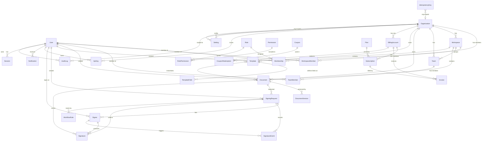

# Signara — Entity-Relationship Diagram

Source of truth: `packages/database/prisma/schema.prisma`
Migrations: `packages/database/prisma/migrations/`

All primary keys are `uuid()` strings. Every tenant-owned table carries `organizationId`
(except global/system tables) and is queried through the tenant isolation layer — see
[Architecture.md](Architecture.md#tenant-isolation) and
[AdministrationGuide.md](AdministrationGuide.md#tenant-isolation).

## Key relationships

| Pair | Cardinality | Notes |
| --- | --- | --- |
| Organization → Workspace → Team | 1:N / 1:N | Team may be org-level (`workspaceId` null) |
| Membership | unique (org, user) | Role enum + optional custom `Role` FK |
| Document ↔ DocumentVersion | 1:N | immutable versions, unique (document, version) |
| Document ↔ SigningRequest → Signer | 1:N / 1:N | sequential order via `Signer.orderIndex` |
| Signer ↔ Signature | 1:0..N | one signature per signer per request in practice |
| SignatureEvent | append-only | every signing lifecycle transition |
| BillingAccount | unique (organization) | 1:1 with Organization |
| AuditLog | append-only | org-scoped; never updated, only inserted |

## Integrity rules (enforced in migration SQL)

- `Document.sizeBytes >= 0`, `Document.version >= 1`
- `Signer.orderIndex >= 0`, `reminderCount >= 0`
- `Plan.price* >= 0`, `Subscription.seats >= 1`, `Invoice.amountDue >= 0`
- Partial unique index: at most one global `Setting` row per `key`
- Functional index for case-insensitive pending-signer lookup
- `AuditLog`/`SignatureEvent` are append-only by contract (guards at the API layer)

See [docs/Deployment.md](Deployment.md) for backup/restore of this schema.